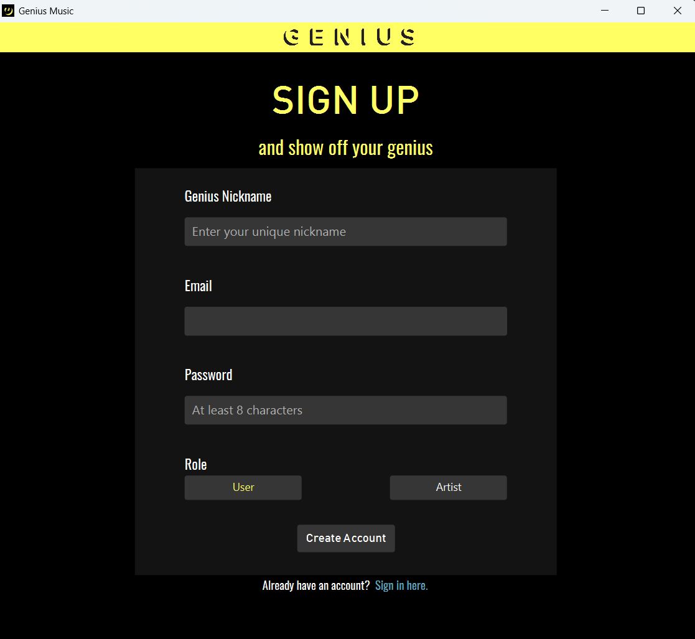

# GENIUS


**GENIUS** is a comprehensive music management platform that allows users to explore songs, albums, and artists. It provides specialized interfaces for different user roles including regular users, artists, and administrators.

> **Disclaimer**: This project is not affiliated with, endorsed by, or associated with Genius Media Group Inc. All names, logos, and references to "Genius" are used for educational purposes only.

## Features

### For Users
- Browse and search for songs and albums
- View song details including lyrics, release date, views, and likes
- Like songs and view song charts
- Request lyrics edits for songs
- Add comments to songs and albums

### For Artists
- Manage your music catalog
- Add, edit, and delete songs
- Create, edit, and delete albums
- Upload album artwork
- Review and manage lyrics edit requests from users

### For Administrators
- Approve or reject artist registration requests
- Manage lyrics edit requests
- Monitor platform activity

## User Interface
GENIUS features a modern, sleek interface with a distinctive yellow and black color scheme inspired by the original Genius.com branding.

### Authentication Screens

**Sign Up Screen**  


**Sign In Screen**  


**User Interface**  


### Song Management

**Add Song Interface**  


### Song Details


### Album Management

**Create Album Interface**  


### Album Details


## Technical Details
GENIUS is built using:

- **Java**
- **JavaFX** for the user interface
- **FXML** for layout definitions
- Custom file-based data storage system

## Installation Process

Building from Source
1. Clone the repository:

   ```
   git clone https://github.com/AryanGh-imp/GENIUS.git
   ```
2. Build the project using Gradle:

   ```
   ./gradlew build
   ```
3. Run the application:
 
   ```
   ./gradlew run
   ```

## Contributing
Contributions are welcome! Please feel free to submit a Pull Request.

## License
This project is licensed under the MIT License - see the [LICENSE](LICENSE) file for details.

## Thanks To
Professor: [Dr.SaeedReza Kheradpishe](https://www.linkedin.com/in/saeed-reza-kheradpisheh-7a0b18155/)

Head TA: [Farid Karimi](https://github.com/Farid-Karimi)

Mentor: [Amirali Nasiri](https://github.com/amiralinasiri27)
